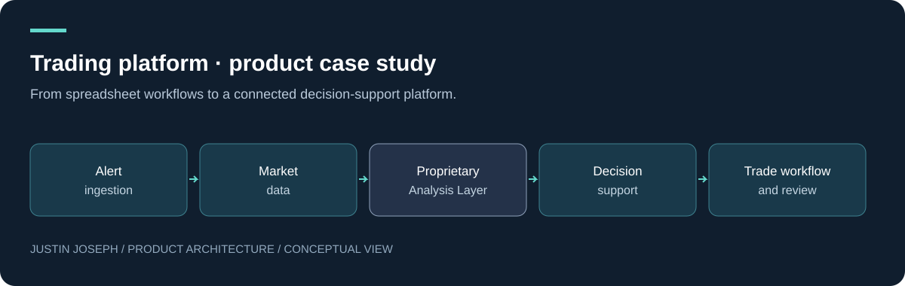

01 / FLAGSHIP

# From workflow prototype to connected platform

**Justin Joseph · Product Manager — FinTech, Trading Platforms & Decision Systems**

The product challenge is continuity: an alert enters, data arrives, background work completes, and the user needs a coherent place to review progress and outcomes.

## Read the case

| Document | What it demonstrates |
| --- | --- |
| **[Product journey](docs/portfolio.md)** | Problem, boundaries and the evolution of the platform |
| **[Complete project index](docs/project-index.md)** | Coverage across platform, data, UX, AI and operational work |
| **[Delivery approach](docs/delivery-playbook.md)** | A concrete scope decision, failure scenarios and measurement plan |

## Product scope

Spreadsheet applications → automated workflows → browser decision portal → reliability iteration → proposed service evolution.

## My contribution

My work spans product framing, workflow design, technical requirements, architecture choices, AI-assisted implementation and hands-on iteration. The key design principle is continuity: keep item identity, data state and workflow outcomes coherent across components.

## Evidence and maturity

Implementation artifacts and recorded iteration support the platform story. Mobile concepts, streaming and service migrations carry separate design or proposal status.

The portfolio documents product work and reasoning. It does not claim quantified adoption, commercial impact or trading performance.

[Portfolio profile](https://github.com/justin5128) · [All project workstreams](https://github.com/justin5128/trade-platform-case-study/blob/main/docs/project-index.md) · [Disclosure boundary](SECURITY.md)

---

This repository is a sanitised product and architecture case study. Production source code, credentials, proprietary analytical methods, operational configurations and confidential business logic are intentionally excluded.

© Justin Joseph. Portfolio documentation. Production implementation and proprietary methods are not included.
