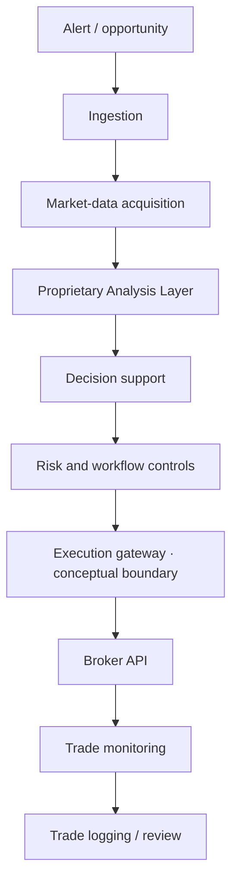

# Trading platform: product journey

[Repository overview](../README.md)

## Why this product exists

The product challenge is continuity. An opportunity enters through one workflow, market data arrives through another, analysis completes asynchronously, and a user needs a reliable place to review and act. A collection of working scripts does not automatically create a coherent product.

My approach has been to define the user journey, decompose responsibilities, use the prototype to learn, and revisit the architecture as behavior becomes harder to coordinate.

## System boundaries

The diagram shows product responsibilities. It does not document current hosting, routes, data structures, configuration, or analytical internals. Research and evaluation are separate product workstreams; they are not a public description of analytical feedback loops.

## Evolution

| Stage | Evidence and product meaning | Next question |
| --- | --- | --- |
| Spreadsheet applications | Earlier trading-application artifacts establish the prototype foundation | Which tasks benefit most from a dedicated interface? |
| Alerts and automation | Alert receivers, processing and data-acquisition artifacts establish workflow decomposition | How can incomplete work remain visible? |
| Connected decision portal | Browser UI, chart, backend orchestration and logging artifacts exist | Who owns authoritative status? |
| Reliability iteration | Regression, diagnostics, cache and task-specific workflow work is documented | Can a delayed response overwrite a newer selection? |
| Mobile exploration | Separate mobile and sticky-control mockups exist | What context must stay visible on a small screen? |
| Research tooling | Historical-data and backtesting workbook artifacts exist | How should research runs become traceable product objects? |
| Service evolution | Dedicated database, gateway and streaming designs are proposals | Which boundary can move with the least workflow disruption? |

These stages describe a progression of concerns, not a dated release history. An artifact is evidence of work, not proof of successful deployment or commercial use.

## A concrete iteration: visible state and background work

**Problem:** a user can submit an action while the interface still appears unchanged, or select another item before an older response returns.

**Product hypothesis:** immediate, item-specific feedback can improve comprehension if the backend remains authoritative.

**Requirement:** show pending feedback on the selected item, reconcile with the eventual result, and prevent one item's response from replacing another item's view.

**Development approach:** inspect ownership of rendering and requests, define the expected sequence, use AI-assisted implementation, and test rapid item switching and delayed responses.

**Evidence limit:** the development record contains this requirement and related regression work. This portfolio does not assert a measured latency reduction or claim that every runtime path is fully resolved.

**Lesson:** responsiveness and correctness must be designed together.

## Project map

The [complete project index](project-index.md) groups the identified work into platform and experience, data and research, and AI and operations. Each entry links to its public case and states the supporting evidence level.

The [delivery approach](delivery-playbook.md) connects one concrete workflow problem to prioritization, a scope decision, engineering collaboration and validation.

## What I own

Product framing and scope; workflow and information architecture; technical requirements; implementation decisions and AI-assisted development; test design; diagnosis of failures; iteration and migration planning.

The public repository contains documentation created now. It does not recreate historical commits or present AI-assisted work as independently hand-coded engineering.

## Outcomes and validation

The observable outcome is an evolving collection of connected product artifacts and a clearer architecture narrative. User counts, trading results, uptime and performance benchmarks are not claimed.

A useful next validation cycle would check whether an analyst can identify the selected item, distinguish stale from fresh data, recognize pending versus completed work, recover from a failed request, and review a recorded outcome without consulting backend implementation.

## Further reading

- [Architecture decisions](https://github.com/justin5128/product-architecture-decisions)
- [Requirements and concepts](https://github.com/justin5128/product-specifications)
- [Synthetic UX](https://github.com/justin5128/trading-product-ux)
